# HH Pro — User Guide

A walkthrough of the contractor portal as it stands today, following the work a
real contractor would actually do: look at what needs attention, build a scope,
see your pricing, and move an order forward.

> **Status: through Milestone 8, plus the L8 remediation, team roles, a mobile
> UX pass, an accessibility pass, the dealer admin console, and the catalog
> as its own destination.**
> Everything below is live and clickable.
> Things that don't exist yet are called out honestly in
> [What isn't built yet](#what-isnt-built-yet) rather than being implied.

**You are:** Dana Reyes of **Summit Ridge Builders**, a Pro-tier charge account
at **Dibbits Landscape Supply** on Net-30 terms.

---

## Getting started

```bash
npm install
npm run dev          # http://localhost:5173
```

The app opens with demo data already in place — eight orders across four
projects, priced through the same pricing engine the live app uses. Nothing to
log into; you're already Dana.

---

## 1. The Procurement Board

This is home. It replaces the product-page-and-cart model that contractors
abandon halfway through.

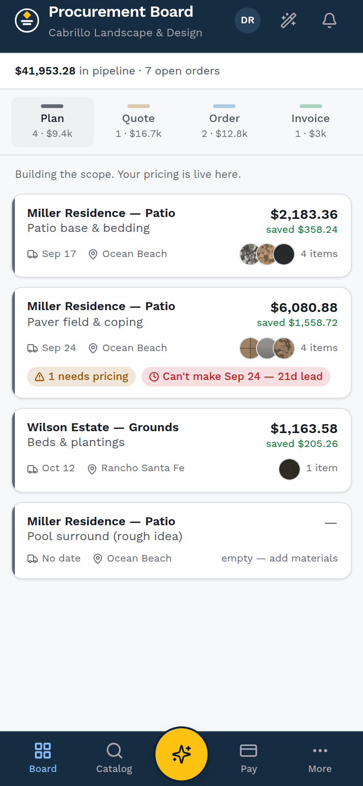

**Every card is an order** — a package of materials with one delivery date and
one fulfillment method. A card is *not* a whole job: "Wilson Custom Home" has a
framing package that's already shipping, a roof package on the way, and interior
trim still being planned. Those are three cards in three different columns,
because they genuinely need three different things from you.

Read a card top-down:

| What you see | What it means |
|---|---|
| **Miller Residence — Deck** | The project. This is how you think about the work. |
| Deck framing & footings | The order. What's actually being bought. |
| **$690.44** / saved $146.28 | Your price, and what your account terms saved against list. |
| 🚚 Aug 9 · Sioux Falls · product photos | Delivery method, requested date, site, and what is on it. |
| ⚠ 1 needs pricing | Something on this order has no dealer price yet. |
| 🕐 Can't make Aug 9 — 23d lead | **A line can't physically arrive by your date.** |

That last one is worth pausing on. The concrete on the Miller framing order is
out of stock and 23 days out, but you asked for delivery in 9. Nothing else
would have told you that until the truck didn't show up.

### Moving between stages

Tap the stage names to switch columns. Counts and running totals sit under each.

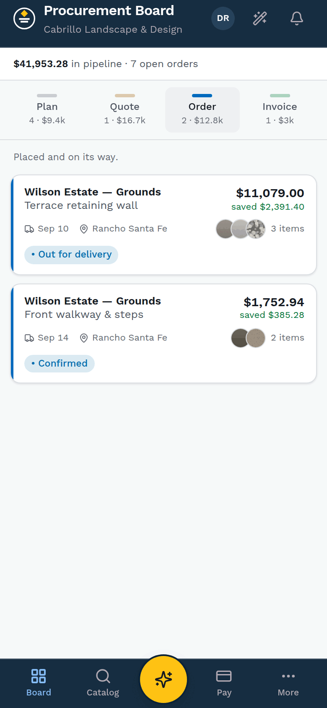

On a phone the four stages are tabs rather than columns — four columns on a
390px screen gives each card about 90px, which is unreadable. On desktop you get
the familiar kanban.

---

## 2. Opening an order

Tap any card.

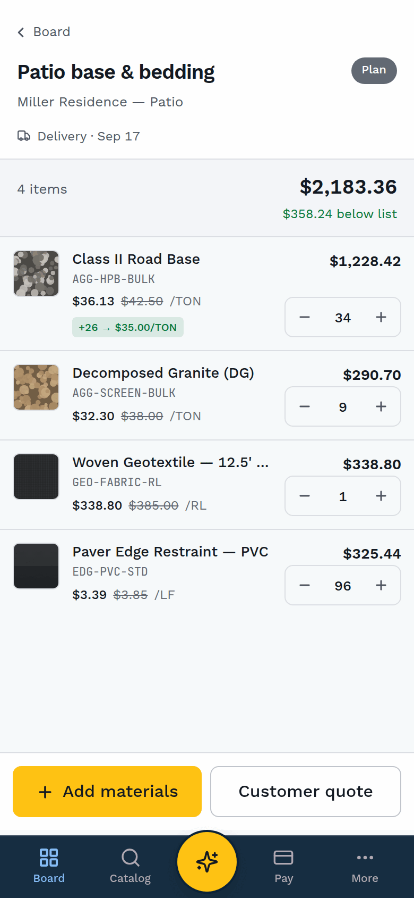

Every line shows **your price with the list price struck through beside it**.
That contrast is the entire reason to buy through a dealer portal instead of a
retail site, so it's on every line rather than buried in a summary.

The green chips are volume opportunities: *"+94 → $22.86/EA"* means 94 more of
those posts drops your unit price from $24.58 to $22.86. Your ERP already knows
this; most portals never tell you.

Tap a line for the full detail.

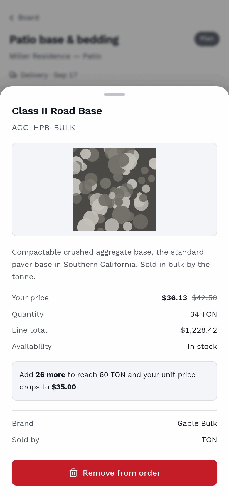

---

## 3. Adding materials

> **About the product images.** Dibbits' catalogue has no photography in this
> build, so every product shows a measured colour-and-texture swatch rather
> than a picture. The colours were taken from the manufacturers' own published
> swatches — Blu 60 really is Beige Cream, Borealis really is Hazelnut Brandy —
> and the handful that are inferred from the product type are marked as such in
> the data. A swatch shows you the material without pretending to be a
> photograph of the exact unit that will arrive, which matters when you are
> ordering 640 square feet of it.


Tap **Add materials**. Three ways in, in the order you'd reach for them.

### Search the catalog

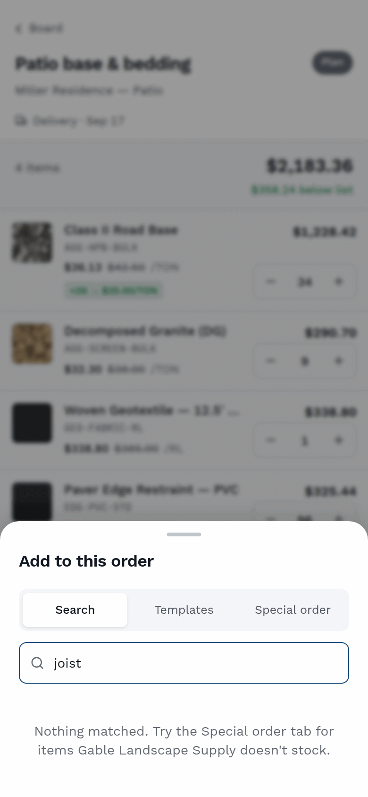

Type a product name or paste a SKU. Adding something already on the order bumps
its quantity instead of creating a duplicate line — which also means the
combined quantity can reach a volume break.

This is the quick path when you already know what you want and you are standing
in the order. When you want to *look* — compare two pavers, check what a tonne
of base costs, see what is on the yard — that is the [Catalog](#4-the-catalog),
and it works the other way round: find the product first, then choose the plan
it goes on.

### Start from a template

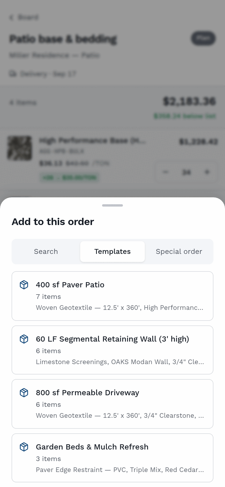

If you build decks, you build the same deck fifty times. Four starter
bills-of-materials are included; applying one adds every line at once and merges
anything you already had.

### Something they don't stock

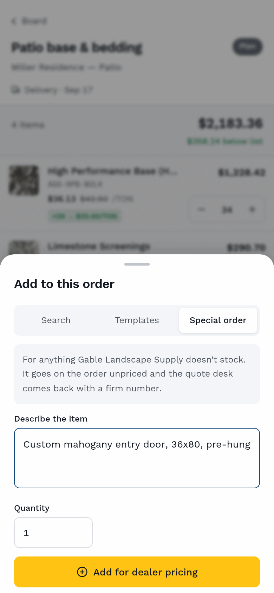

This is the one that keeps a job from leaving the portal. Describe the custom
door, the odd trim profile, the special-order rail kit. It goes on the order
**unpriced** with an `SO-` tag, and routes automatically to Dibbits Landscape Supply's quote desk
for a firm number.

It is deliberately *not* given a made-up price. A number nobody has stood behind
is worse than no number.

---

## 4. The catalog

Tap **Catalog**. This is the yard, with your prices on it.

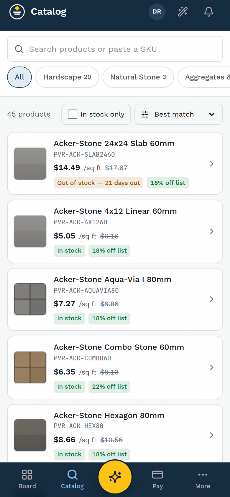

Every row carries **what you pay, in the unit the thing is actually sold in** —
per square foot for pavers, per tonne for base, per bag for jointing sand —
with list struck through beside it and the stock position said out loud. That
matters more here than in most catalogs: "$36.13 /tonne" is a number you can
build a quote from, and "$42.50 EA" for a tonne of gravel is not a number at
all.

The prices are the same ones the board uses. There is no separate "catalog
price" that turns into something else once it is on an order — the contract
price your rep negotiated on Yorkville shows up here as 22% off list while
everything else in Hardscape shows 18%, because it is the same pricing engine
answering.

### Categories drill in rather than listing everything

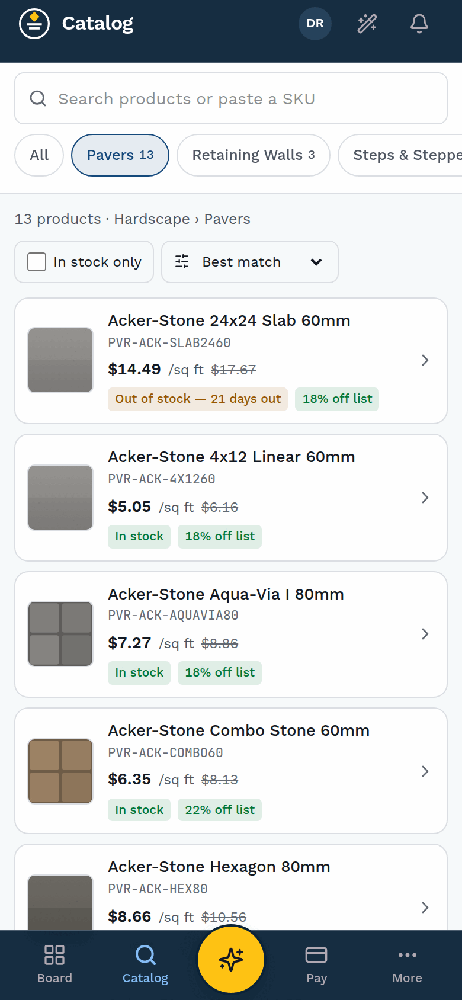

Eighteen headings across the top of a phone is a wall. Tap **Hardscape** and
the row becomes what is under it; tap **Pavers** and it stays on its siblings,
so you can step across to Retaining Walls without going back up. The counts are
live, and a heading with nothing under it is not shown at all — a tap that
leads to "no products" is a tap you paid for.

The search, the category and **In stock only** all live in the address bar. So
backing out of a product returns you to the exact list you were reading, and a
filtered catalog is a link you can send to your PM.

### When nothing matches, it says so

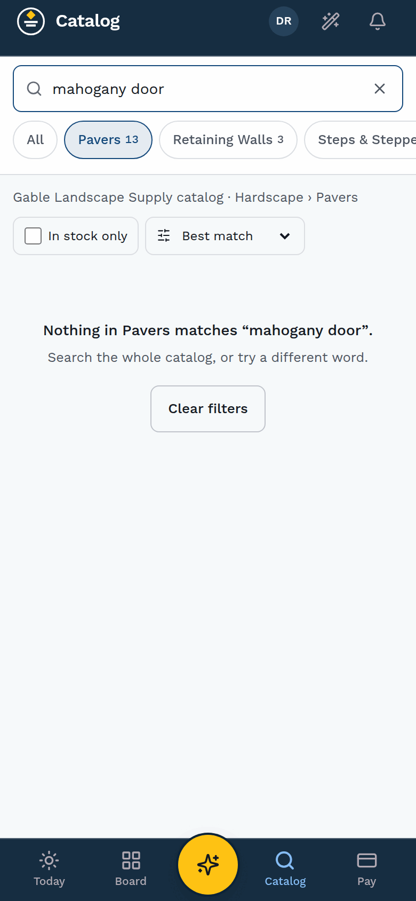

Not "0 results". *"Nothing in Pavers matches “mahogany door”."* — the words you
typed and the place you were looking, because "wrong word" and "wrong category"
are different problems with different fixes. Searching the whole catalog for
something Dibbits Landscape Supply genuinely does not stock points you at the
special-order route instead, which is where that job actually gets done.

### One product, at the quantity you need

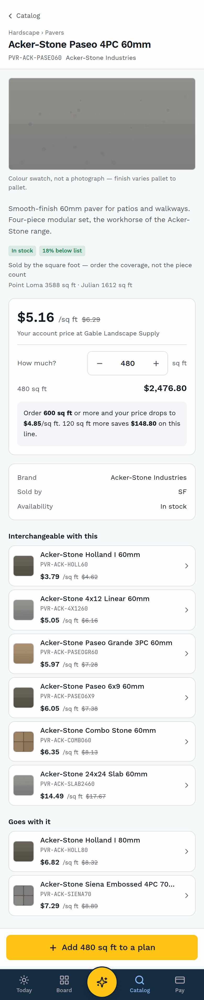

The quantity control is the point of this page, not a form field. Hardscape
pricing moves with volume, so the price answers back as the number changes —
and the next break is a sentence rather than arithmetic:

> Order **600 sq ft** or more and your price drops to **$4.85**/sq ft.

**Interchangeable with this** only ever offers products that genuinely
substitute. A 60mm patio paver is not offered as an alternate for an 80mm
driveway paver, and outdoor porcelain is not offered as an alternate for
concrete — different material, different bedding, and a swap that would mean
relaying the job.

### Add it to a plan. There is no cart

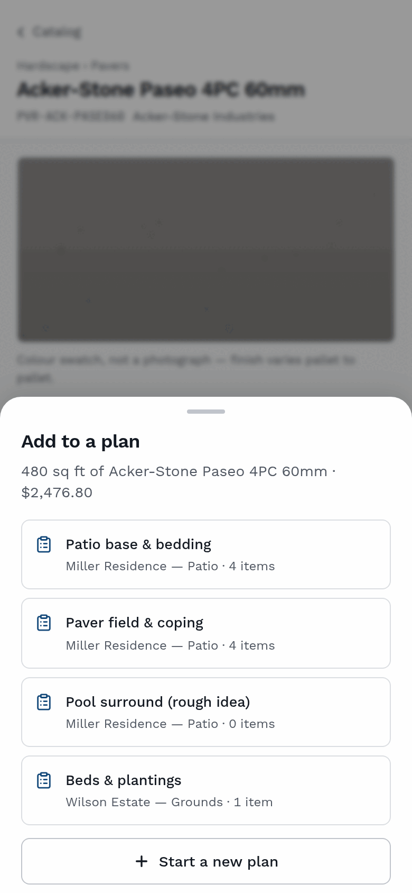

This is the one place where this product looks least like a store, and it is
deliberate. A cart is a second place your intentions live: no job, no delivery
date, no site, and nothing on the board to remind you it exists. So the button
asks the question a cart never does — **which plan?**

- Every plan listed is a Plan-stage order that already belongs to a job.
- Plans Dibbits Landscape Supply already holds are not offered at all. The
  scope is locked once they are pricing or picking it, so a destination that
  would refuse on tap is not shown as a destination.
- If the plan already carries that SKU, the row says so **before** you tap, and
  adding **raises that line's quantity** rather than creating a second one —
  which also means the combined quantity can reach a volume break.
- **Start a new plan** creates one draft order on the job you pick, in Plan,
  with the line already on it. If anything about the line is wrong, the draft
  is not left behind.

Whichever you choose, the confirmation offers **Open plan**, because material
that landed somewhere you cannot see is exactly the cart behaviour this avoids.

---

## 5. Moving an order forward

Press and hold a card, then drag it onto a stage. The stage bar becomes your
drop targets.

### When the rules say no

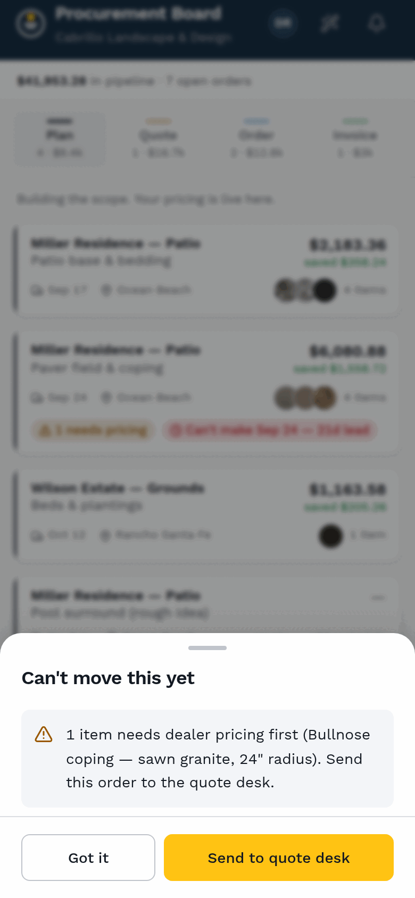

The "Decking & rail" order contains a special-order rail kit with no dealer
price, so it can't jump straight to Order. Rather than the card just refusing to
go, the board tells you exactly what's blocking it and what to do instead.

**The quote desk is a gate, not a toll booth.** An order that your account
pricing already covers can go straight from Plan to Order without a salesperson
touching it — that's the whole point of having terms. But an order carrying an
unpriced special-order line *must* be quoted first, or you'd be committing to a
number nobody has agreed to.

### When it's allowed

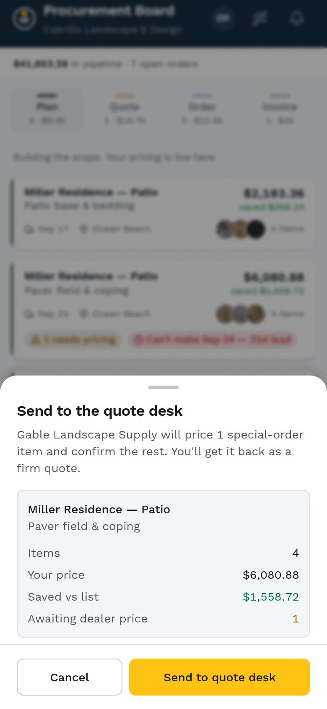

Every cross-stage move confirms first, and names the consequence in plain
language — because dragging a card is about to put work on someone's desk or
commit you to a purchase. You should never find that out afterwards.

> **Invoice is the supplier's move.** You can't drag a card there. Orders arrive
> in Invoice when Dibbits Landscape Supply delivers and bills them.

---

## 6. Dibbits Landscape Supply works while you don't

Once you send an order, the card tells you what's happening on their side without
you opening anything.

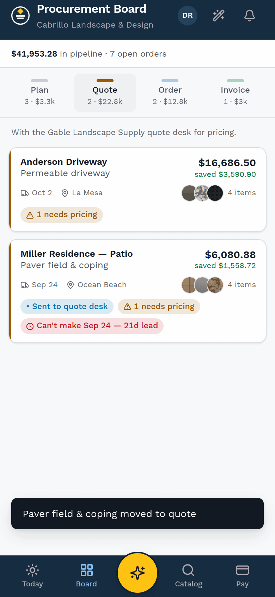

The desk takes hours, not milliseconds — a person is pricing it, and an instant
answer would be a lie. Which is a problem for a demo, so:

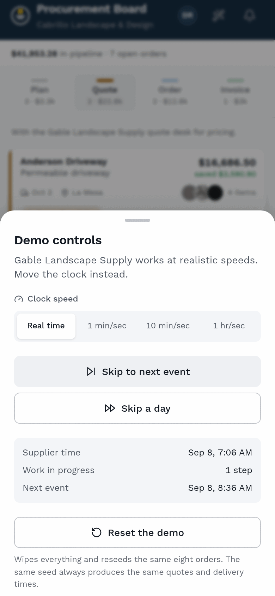

**Demo controls** (the wand in the header) move the *clock*, not the simulation.
The supplier's delays stay realistic; you just stop waiting through them.

- **Skip to next event** — jumps to the exact moment the next thing happens,
  whether that's twenty minutes or nine days out. This is the one you'll use.
- **Skip a day** — for watching a delivery date arrive.
- **Clock speed** — let it run in the background at up to an hour a second.
- **Reset the demo** — back to the same eight orders. The same seed always
  produces the same quotes and delivery times, so a demo is repeatable.

Skip forward twice and the quote comes back:

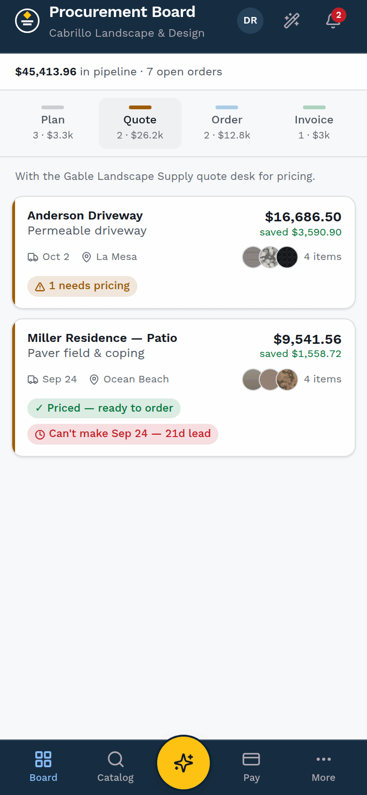

Compare this card to before. The total went from **$1,160.04 to $2,228.61** —
Dibbits Landscape Supply priced the special-order rail kit. The "1 needs pricing" warning is gone,
replaced by **"✓ Priced — ready to order"**. The lead time updated to the 24 days
the desk actually quoted. And the move that was blocked five minutes ago now
works.

### What happened while you were away

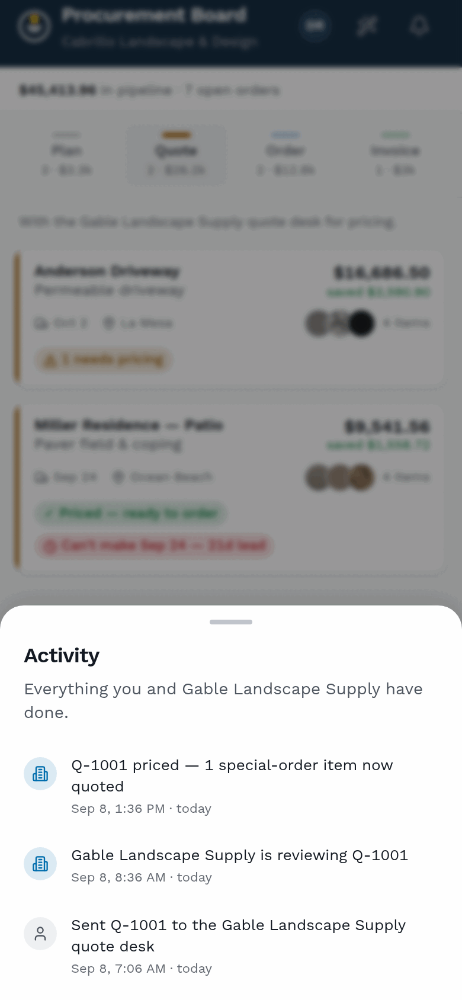

The bell counts things Dibbits Landscape Supply did. Sim events are frequent at speed, so they
accumulate here behind a badge rather than interrupting you with toasts.

Note the timestamps: sent at 1:24 PM, acknowledged at 2:54, priced at 7:54.
That's a real working day, not a progress bar.

**Orders behave the same way.** Place one and it walks itself through confirmed
→ being picked → out for delivery → delivered → invoiced, and then **moves itself
into the Invoice column**. Two rules keep it honest: nothing is dispatched before
the date you asked for, and a will-call order parks at "ready for pickup" rather
than pretending someone collected it.

All of this survives a reload — close the tab mid-quote and the work continues
in supplier time. Come back and it's waiting for you.

### Dealer pricing doesn't last forever

Dibbits Landscape Supply holds a quoted price for 14 days, because lumber moves. When it lapses,
the order that was ready to place becomes blocked again — and says so plainly:

> Dibbits Landscape Supply's pricing on 1 item has expired (Trex Transcend rail kit — Pebble Grey).
> Send this order back to the quote desk for a fresh price.

That's deliberately worded differently from "needs dealer pricing." A price that
ran out and a price that never existed feel like different problems, because
they are.

---

## 7. Selling the job to your customer

Open any order and tap **Customer quote**.

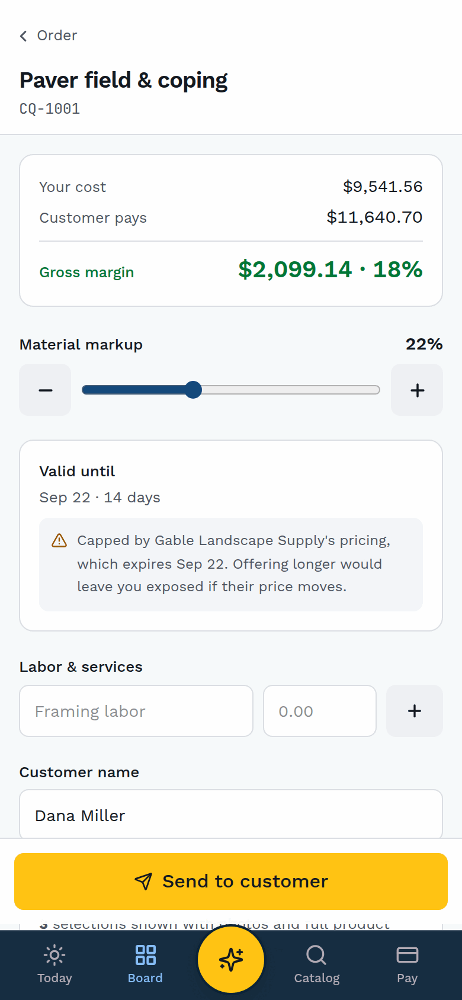

This is your document, not Dibbits Landscape Supply's. Set a material markup, add labor and
overhead, and your **gross margin stays on screen the whole time** — this is the
one place in the app where the number that matters is yours.

The **Valid until** date is capped by Dibbits Landscape Supply's pricing. If their quote expires in
9 days, you can't offer your customer 30 — you'd be holding a price nobody is
protecting you on. The app says so rather than letting you find out later.

### What your customer opens

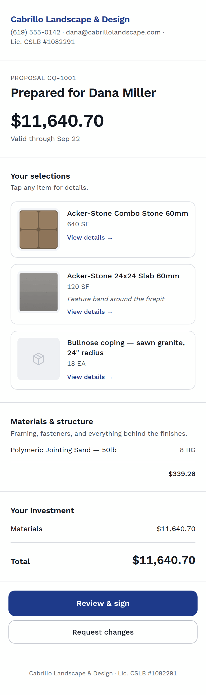

Your brand, your phone number, your license. **Dibbits Landscape Supply appears nowhere**,
and neither does your cost. It's a proposal, and it reads like one on the phone
it'll actually be opened on.

The important split: **selections get a story, commodities get a line.**

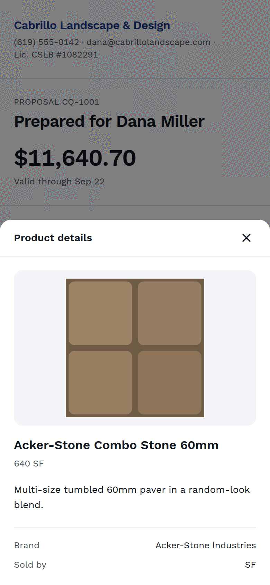

Your customer agonised over the decking colour. They did not choose the joist
hangers. So the Trex gets photography, the manufacturer's description, coverage,
dimensions — everything that makes them feel good about what they picked — and
the framing is summarised as "Materials & structure."

Getting this backwards is how proposals end up burying the decision the customer
actually made under a parts list.

### Signing

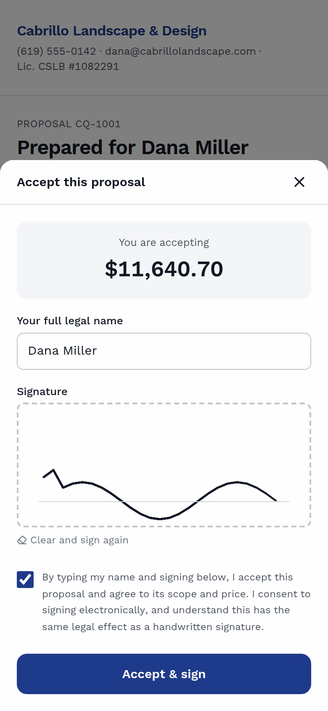

Accepting isn't a button. Your customer types their full legal name, signs, and
explicitly consents to signing electronically. A tap is a click; a signature is
a decision — and it should feel like one on both sides.

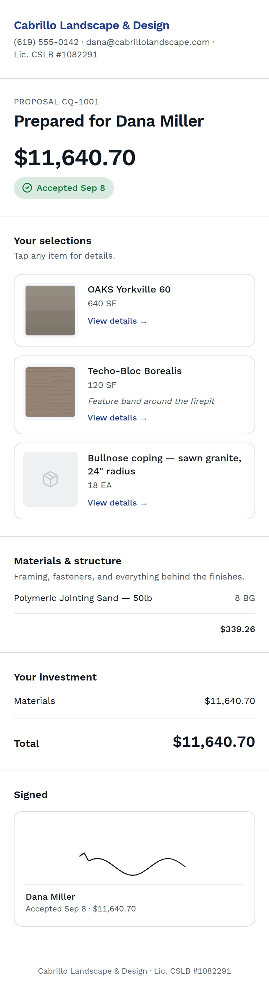

What's stored isn't a boolean. It's the typed name, the drawn mark, the exact
consent wording they were shown, the timestamp, and **the total they agreed
to** — frozen, so a later edit can't quietly rewrite what was signed. If you
ever have to stand behind "they accepted," this is what you'd stand on.

The proposal also freezes at send: editing the order afterwards doesn't change
what your customer is reading. Re-sending mints a **new link and kills the old
one**, so a superseded proposal can't still be accepted.

---

## 8. Tracking what's on the way

Once Dibbits Landscape Supply holds an order, open it and tap **Track this order**.

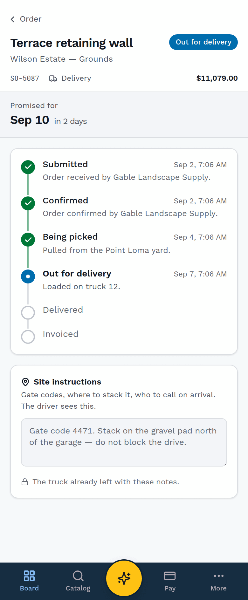

The headline answers the only question that matters — *when is it arriving* —
before anything else. Below it, the full history in the supplier's own words:
confirmed, pulled from the Main Yard, loaded on truck 12.

Two things you can do from here while they still make sense:

- **Site instructions** — gate codes, where to stack it. Editable until the
  truck is loaded, then locked with a note saying why. Changing a drop-off after
  dispatch isn't a UI problem, it's a phone call.
- **Move the delivery** — reschedule, but only before it's out for delivery.
- **Will-call orders** park at *Ready for pickup* and wait for you to confirm
  you've collected them, rather than assuming it.

---

## 9. Getting paid up

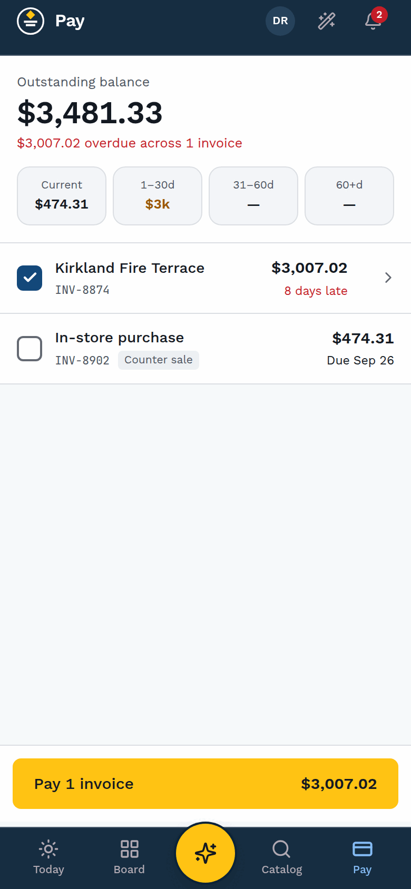

Everything you owe Dibbits Landscape Supply, aged the way an AR statement does it. Tap a bucket to
filter.

Note the second line: **"In-store purchase · Counter sale."** Material bought at
the trade desk lands in the same place as everything ordered through the portal.
That's the whole claim of an all-in-one AR screen — a portal that only shows you
half your balance isn't worth opening.

Select any number of invoices and pay them together.

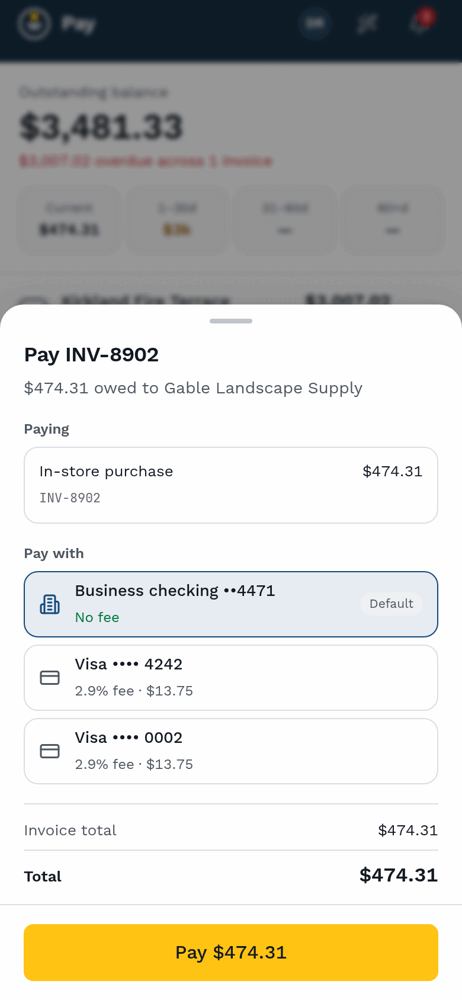

Every saved method is priced side by side, because **the difference is real
money**: ACH is free, a card is 2.9%. On a $1,237 payment that's $35.88, and you
should see it before you choose, not after.

Declines are handled honestly too — the demo includes a card that always fails,
and when it does you get *"Card declined by issuer. Nothing was charged and your
balance is unchanged"* with the picker still open. A demo that only ever shows
the happy path teaches nothing.

---

## 10. Seeing a whole project

Tap the project name in an order's header.

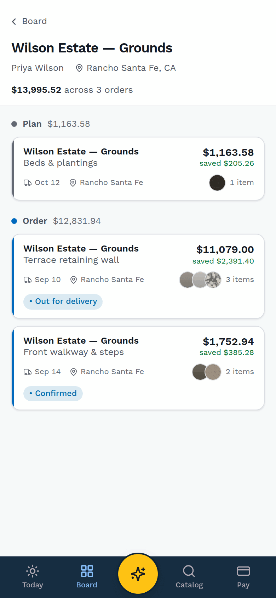

The board answers *"what needs me next?"* across every job. This answers
*"where does the Wilson house stand?"* — its three orders grouped by the stage
each one is actually in, with the project total across all of them.

---

## 11. The assistant

Tap **◆** in the middle of the bottom bar.

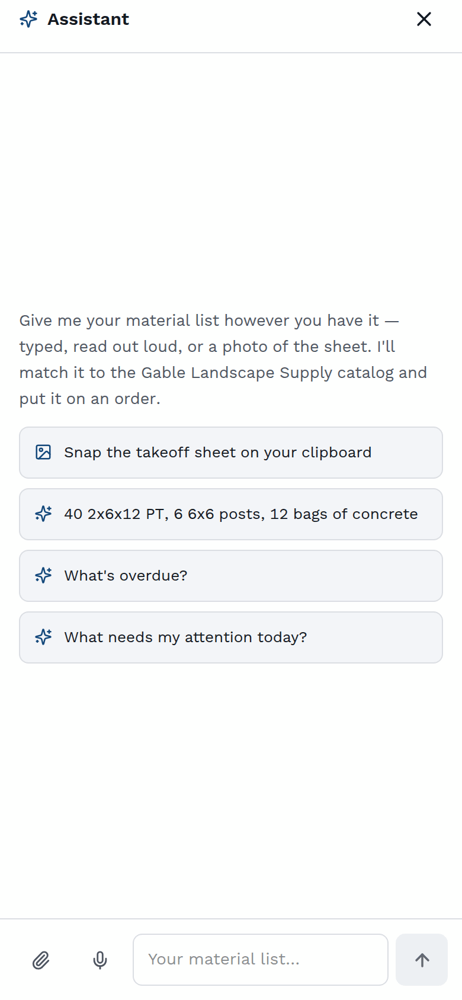

Its main job is the boring one that costs you an hour: **turning a material
list into order lines**. Give it the list however you already have it —

- typed or pasted: *"40 2x6x12 PT, 6 6x6 posts, 12 bags of concrete"*
- **dictated** — tap the mic and read it out, which beats typing with gloves on
- **photographed** — tap the clip and snap the takeoff sheet on your clipboard,
  or attach a PDF

It matches each line to a real SKU, prices it through your account, and puts it
on an order. Anything Dibbits Landscape Supply doesn't carry goes on as a special-order line —
unpriced, flagged for the quote desk — rather than being quietly swapped for
something else.

**It never invents a quantity.** If your list says 40, it adds 40; if a
quantity is missing it asks. It does not size a job from measurements — that's
a separate takeoff tool, and this one won't pretend.

You can also just ask it things: *"what's overdue?"*, *"what's the lead time on
the Trex?"*, *"what's blocking the Anderson order?"*

### What it can and can't do on its own

| | |
|---|---|
| **Runs silently** | Reading the board, an order, the catalog, your invoices |
| **Runs and tells you** | Adding, removing, and re-quantifying lines; setting dates; drafting a customer quote — all your own draft, all reversible |
| **Asks first, every time** | Sending to the quote desk, placing an order, sending a customer quote, paying an invoice |

Anything that reaches Dibbits Landscape Supply or moves money stops and waits for you.
You'll see exactly what it's about to do, and it doesn't happen unless you tap
**Approve**.

Every tool call shows up in the thread as it runs — what it did, and when
something is refused, the supplier's own reason word for word. "It added 12
things" with nothing to check would not be worth trusting.

### Your supplier switches it on

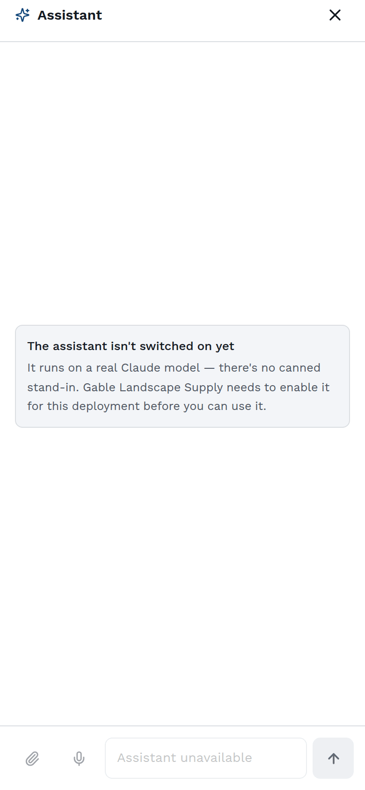

The assistant talks to a real Claude model. Until your supplier enables it, it
renders disabled and says so — there is deliberately **no** canned fallback,
because a fake assistant would undermine the one part of this product that has
to be real.

There is nothing for you to configure, and no key for you to paste. The
credential belongs to your supplier: they set it once in their own admin
console, they decide whether the assistant is switched on, and the usage bills
to them. If you want it and don't have it, that is a conversation with your
rep, not a setting on this screen.

They can also see how much each account is using, and cap it per contractor —
so if you run out for the day, it is a number they can raise.

---

## 12. Your team

Tap **More**.

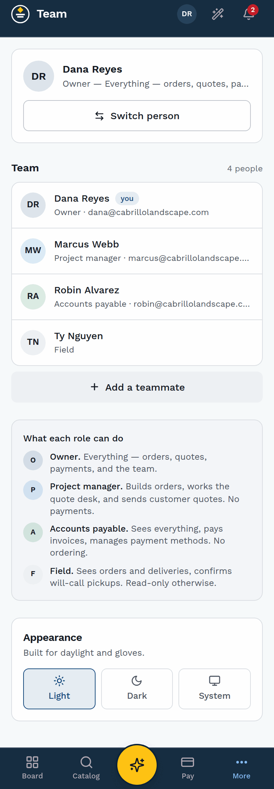

A six-person outfit is not one login. Add the people who actually touch this —
your PM, whoever pays the bills, the crew lead — and give each a role:

| Role | What they can do |
|---|---|
| **Owner** | Everything, including managing the team |
| **Project manager** | Builds orders, works the quote desk, sends customer quotes. No payments. |
| **Accounts payable** | Sees everything, pays invoices, manages payment methods. No ordering. |
| **Field** | Sees orders and deliveries, confirms will-call pickups. Read-only otherwise. |

Tap the initials chip in the header to switch between people.

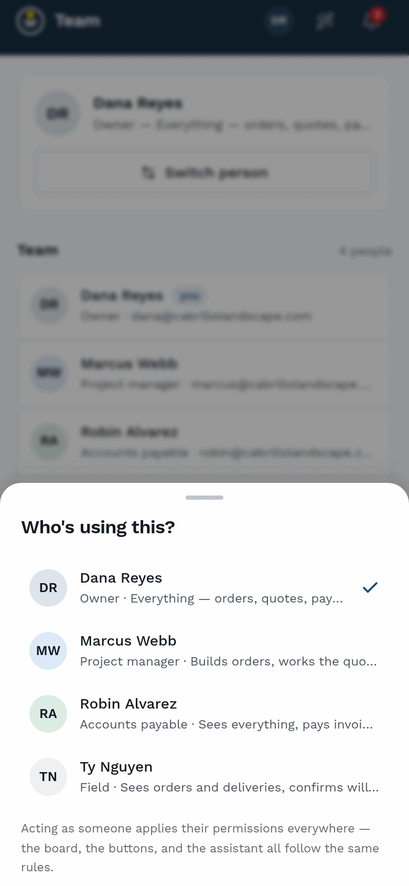

In this demo that stands in for logging in — pick Robin and the whole app behaves as
accounts payable: the Pay screen works, and trying to send an order to the
quote desk explains *"Only Dana Reyes or Marcus Webb can send orders to the
supplier — you're in as Robin Alvarez (Accounts payable)."*

That sentence is the point. A refusal that just says "not allowed" leaves you
stuck; one that names who *can* tells you who to call. The same rule governs
the buttons, the board drags, and the AI assistant — there is one permission
check, not three, so nothing can slip through by a different route.

---

## 13. On a desktop

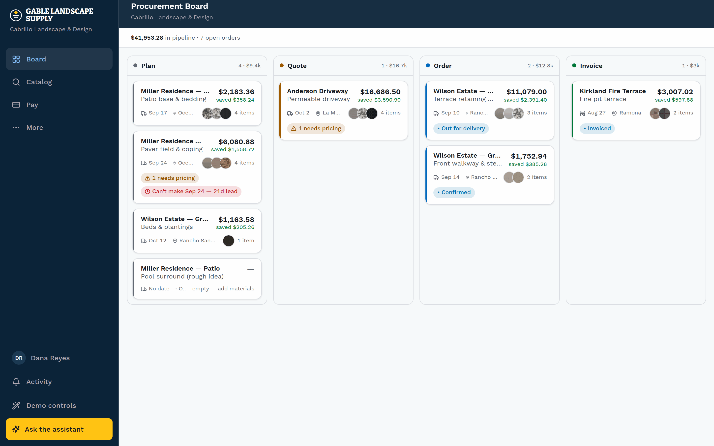

Same data, same rules — a four-column kanban with a sidebar instead of a bottom
bar. Drag works the same way. The assistant docks to the right edge rather than
covering the screen.

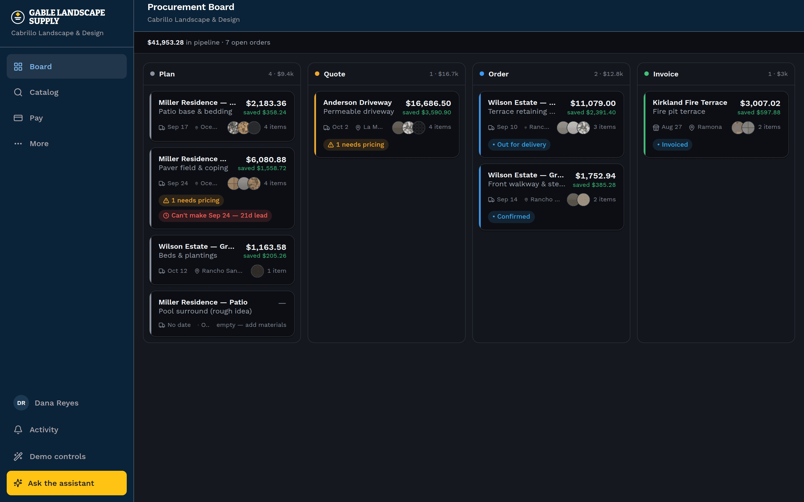

Dark mode is a first-class theme, not an inverted afterthought. The default is
deliberately light: contractors use this in trucks and direct sun, where a dark
UI is unreadable.

---

## 14. For the dealer: the admin console

A different user entirely — the dealer's own staff, not the contractor — at
`/admin.html`.

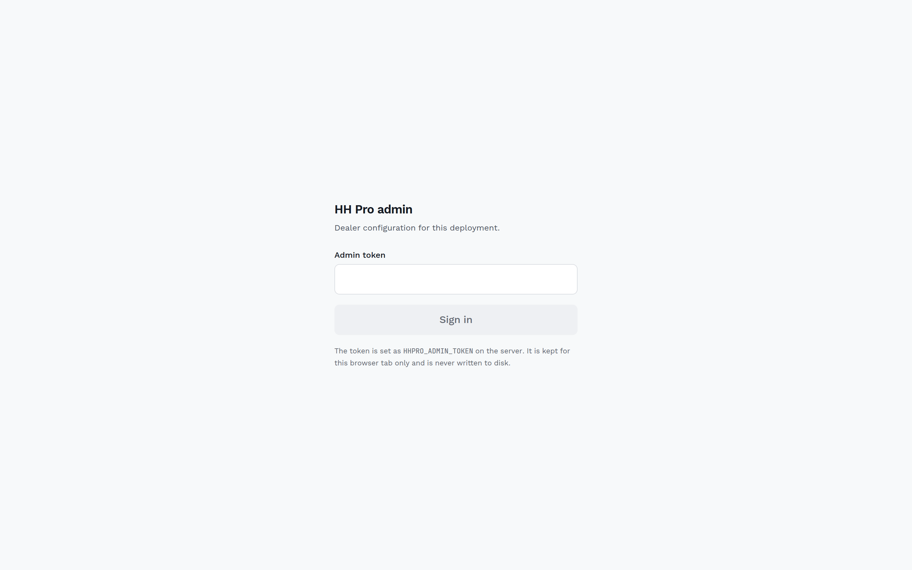

It configures what used to be code: the Anthropic key this deployment runs on,
the dealer's name and brand colour, which Claude model and what it may cost per
day, which features are switched on, payment terms and the card fee, and house
rules appended to the assistant's instructions.

Three things worth knowing:

- **It fails closed.** With no `LUMBERNOW_ADMIN_TOKEN` set, every admin request
  is refused. There is no "open by default" mode for a surface that accepts an
  API key.
- **The key is write-only.** It is checked against Anthropic before it is
  saved, and after that nothing can read it back — the console shows only a
  mask. Fix a typo by replacing it, not by reading it.
- **Branding cannot touch the platform.** A dealer sets their own brand colour;
  stage colours, warnings, and surfaces are not theirs to change, so an order
  looks like an order on every dealer's deployment.
- **Two admins can't overwrite each other.** A save carries the version it was
  built on. If someone else changed the settings meanwhile, the save is refused
  with a message telling you to reload and re-apply — rather than silently
  erasing their change.

Feature flags hide controls; they are not permissions. Every mutation is still
guarded by the same rules whether the button is on screen or not.

---

## Reference: what each stage means

| Stage | What it means | How an order leaves it |
|---|---|---|
| **Plan** | Building the scope. Your account pricing is live here. | You send it to the quote desk, or place it directly if it's fully priced. |
| **Quote** | With Dibbits Landscape Supply's quote desk for pricing. Required when the scope has special-order lines. | Pricing comes back, then you place it. |
| **Order** | Placed with Dibbits Landscape Supply. Delivery or will-call tracking. | Dibbits Landscape Supply delivers and bills it. |
| **Invoice** | Delivered and billed. | You pay it. |

**Scope locks once Dibbits Landscape Supply has the order.** You can edit freely in Plan; once an
order is at the quote desk or placed, the lines are read-only and the reason is
shown. Pull it back to Plan to change it.

---

## Configuring the assistant

The assistant runs on a credential the **dealer** provides. There is no key for
a contractor to paste, and no per-contractor billing — it is one key, set once,
carried by the supplier.

**In the admin console.** Sign in at `/admin.html`, paste an `sk-ant-…` key
under **LLM credential**, and save. It is checked against Anthropic before it
is stored, so a bad paste fails immediately rather than surfacing later as a
contractor's broken message. Nothing reads it back afterwards — the console
shows only a mask.

**Cap it per contractor.** *Daily request cap* applies to each contractor
account separately, not to the deployment as a whole, so one busy crew cannot
exhaust the day for everyone else. Beneath it, **Assistant usage today** lists
who is spending, busiest first, with anything unattributed in its own row. That
is the number to size the cap from.

**A server key (for a shared deployment).** Not `VITE_`-prefixed, so it is never
compiled into anything the browser downloads:

```bash
echo 'ANTHROPIC_API_KEY=sk-ant-...' >> .env
npm run dev        # restart — the key is read at server start
```

If both exist, the key you pasted in the browser wins for that browser.

The dev server exposes `/api/anthropic/health`, which the app checks once at
boot to decide between the working assistant and the disabled state. Requests
go to `/api/anthropic/v1/messages` with a placeholder key; the server swaps in
the real one and streams the response straight back.

The proxy only accepts a short allowlist of models and caps `max_tokens`, so a
leaked endpoint can't be turned into a free relay.

---

## What isn't built yet

Being straight about this, because a demo that pretends is worse than one that
doesn't:

| Feature | Milestone |
|---|---|
| AI-generated takeoffs from drawings or dimensions | separate widget, later |
| A real ERP connection (today Dibbits Landscape Supply is simulated) | M9+ |
| A deployed home for all of this | M9 |

**Catalog browsing has moved off this list** — it is [section 4](#4-the-catalog)
now, with the same account pricing the board uses. What it deliberately does
*not* have is a cart, a wishlist, or a saved-for-later: the only way out of a
product is onto a plan.

Two smaller things it does not do yet, so nobody goes looking: there is no
"order it again" from a past job, and the catalog does not know your takeoff —
you type the quantity, and it prices what you typed.

---

## Regenerating this guide

Screenshots are captured by a script so they can't drift from the app:

```bash
npm run guide     # rebuilds, walks the app, overwrites docs/screenshots/
```

The script drives real interactions — including the drag-and-drop — and
**fails loudly if a screen it expects is missing**, so it doubles as a smoke
test. Update `scripts/capture-guide.mjs` when a flow changes, then edit the
prose here.
